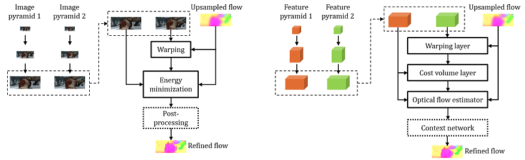

[](https://raw.githubusercontent.com/NVIDIA/FastPhotoStyle/master/LICENSE.md)


## PWC-Net: CNNs for Optical Flow Using Pyramid, Warping, and Cost Volume

### Network Architecture

PWC-Net fuses several classic optical flow estimation techniques, including image pyramid, warping, and cost volume, in an end-to-end trainable deep neural networks for achieving state-of-the-art results.




### Paper & Citation
[Deqing Sun, Xiaodong Yang, Ming-Yu Liu, and Jan Kautz. "PWC-Net: CNNs for Optical Flow Using Pyramid, Warping, and Cost Volume." CVPR 2018 or arXiv:1709.02371](https://arxiv.org/abs/1709.02371)

[Updated and extended version: "Models Matter, So Does Training: An Empirical Study of CNNs for Optical Flow Estimation." 	arXiv:1809.05571](https://arxiv.org/abs/1809.05571)

[Project page link](http://research.nvidia.com/publication/2018-02_PWC-Net:-CNNs-for)

[Talk at robust vision challenge workshop](https://www.youtube.com/watch?v=vVU8XV0Ac_0)

[Talk at CVPR 2018 conference](https://youtu.be/LBJ20kxr1a0?t=421)
 

If you use PWC-Net, please cite the following paper: 
```
@InProceedings{Sun2018PWC-Net,
  author    = {Deqing Sun and Xiaodong Yang and Ming-Yu Liu and Jan Kautz},
  title     = {{PWC-Net}: {CNNs} for Optical Flow Using Pyramid, Warping, and Cost Volume},
  booktitle = CVPR,
  year      = {2018},
}
```
or the arXiv paper
```
@article{sun2017pwc,
  author={Sun, Deqing and Yang, Xiaodong and Liu, Ming-Yu and Kautz, Jan},
  title={{PWC-Net}: {CNNs} for Optical Flow Using Pyramid, Warping, and Cost Volume},
  journal={arXiv preprint arXiv:1709.02371},
  year={2017}
}
```
or the updated and extended version
```
@article{Sun2018:Model:Training:Flow,
  author={Sun, Deqing and Yang, Xiaodong and Liu, Ming-Yu and Kautz, Jan},
  title={Models Matter, So Does Training: An Empirical Study of CNNs for Optical Flow Estimation},
  journal={IEEE Transactions on Pattern Analysis and Machine Intelligence (TPAMI)},
  note = {to appear}
}
```
For multi-frame flow, please also cite
```
@inproceedings{ren2018fusion,
  title={A Fusion Approach for Multi-Frame Optical Flow Estimation},
  author={Ren, Zhile and Gallo, Orazio and Sun, Deqing and Yang, Ming-Hsuan and Sudderth, Erik B and Kautz, Jan},
  booktitle={Proceedings of the IEEE Winter Conference on Applications of Computer Vision (WACV)},
  year={2019}
}
```
### Related Work from NVIDIA 
[flownet2-pytorch](https://github.com/NVIDIA/flownet2-pytorch)

[Learning Rigidity in Dynamic Scenes with a Moving Camera for 3D Motion Field Estimation (ECCV 2018)](https://github.com/NVlabs/learningrigidity)


### Installation
The code was developed using Python 2.7 & PyTorch 0.2 & CUDA 8.0. There may be a problem related to software versions. To fix the problem, you may look at the implementation in PWCNet.py and replace the syntax to match the new pytorch environment. 
Install correlation package (if you haven't installed this package before):
- Go to external_packages/correlation-pytorch-master/, follow the instruction in the readme.MD file there
- You might have to run the command in make_cuda.sh line by line

Additionally, we provide a simple installation script using Anaconda for the above steps:
```
# setup environment
conda create -n pwcnet_test python=2.7 anaconda
conda activate pwcnet_test
# install pytorch and other dependencies
pip install http://download.pytorch.org/whl/cu80/torch-0.2.0.post3-cp27-cp27mu-manylinux1_x86_64.whl
pip install torchvision visdom dominate opencv-python cffi
# install external packages 
cd external_packages/correlation-pytorch-master/
bash make_cuda.sh
cd ../../
```
### Test
-  Test the code: execute script_pwc.py [image1_filename] [image2_filename] [save_flow_filename], e.g. 
	 ```python script_pwc.py './data/frame_0010.png' './data/frame_0011.png' './tmp/frame_0010.flo'```
-  pwc_net_chairs.pth.tar is the pretrained weight using flyingthings3D dataset
-  pwc_net.pth.tar is the fine-tuned weight on MPI Sintel


### Stuffs that may confuse you:
- the RGB channel is reversed to BGR, because this is what Caffe does
- after dividing by 255.0, no further normalization is conducted, because this particular PWC model in Caffe don't perform any image normalizations
- estimated flow should multiply by 20.0, because in training, the GT flow is divided by 20.0


### Note
- The PyTorch code does not fully reproduce the results by the Caffe code because of differences in implementation details, such as resizing and image I/O. Please use the Caffe code to reproduce the PWC-Net results in the CVPR paper and the ROB challenge
- The average EPE at MPI Sintel is 1.83 (clean) and 2.31 (final). For the official Caffe implementation, the average EPE is 1.81 (clean) and 2.29 (final)


### Acknowledgement
- Thanks to Dr. Jinwei Gu and Dr. Zhile Ren for writing the PyTorch code and converting the Caffe model into PyTorch
- Thanks to Dr. Fitsum Reda for providing the wrapper to the correlation code

### Contact
Deqing Sun (deqings@nvidia.com); Zhile Ren (jrenzhile@gmail.com)

### License
Copyright (C) 2018 NVIDIA Corporation. All rights reserved. Licensed under the CC BY-NC-SA 4.0 license (https://creativecommons.org/licenses/by-nc-sa/4.0/legalcode).


